<div align="center">

# DharmaShield
### Policy-Driven RL Environment for Trust and Safety Compliance

[](https://github.com/ankit-choubey/DharmaShield-env)
[](https://github.com/ankit-choubey/DharmaShield-env)
[](https://huggingface.co/blog/openenv-turing)
[](https://arxiv.org/abs/2512.20061)

<br/>

[](https://python.org)
[](https://fastapi.tiangolo.com)
[](https://docker.com)
[](https://huggingface.co/models)
[](./artifacts/v4_final_pytest_after_runbook.txt)

**DharmaShield** provides a comprehensive reinforcement learning environment for training open-source agents to operate as Autonomous Policy Compliance Officers. It is explicitly engineered to navigate the regulatory complexity inherent in the India Information Technology (Intermediary Guidelines and Digital Media Ethics Code) Rules, 2021 and 2026 Amendments.

[Explore Space](https://huggingface.co/spaces/ankit-choubey/dharmashield-env) • [Documentation](#engineering-blueprint) • [Benchmarks](#leaderboard)

## System Status

| Capability | Status |
| :-- | :-- |
| OpenEnv validation | ✅ Ready for multi-mode deployment |
| Automated tests | ✅ 43 passing |
| API contracts (`/reset`, `/step`, `/state`) | ✅ Stable |
| Observability (`/episodes`) | ✅ Enabled |
| UI console (`/ui`) | ✅ Non-fatal mount |
| Strict benchmark integrity | ✅ `fallbacks=0` rows only |

</div>

---

## 1. Introduction and Primary Objectives

DharmaShield establishes a new benchmark for policy-driven content moderation. Traditional benchmarks often reduce content moderation to a binary classification problem (e.g., toxic versus safe). DharmaShield challenges agents by modeling the asymmetric risks of platform governance and survival:

*   **Legal Compliance Moat**: Enforces compliance across critical domains including UPI Financial Fraud (aligned with NPCI patterns), Synthetic Media and Deepfakes (SGI mandates), and Coordinated Inauthentic Behavior (CIB) networks.
*   **Advanced Reward Shaping**: Computes a sophisticated 6-signal hybrid reward function, rigorously derived from Meta's 2025 industrial reinforcement learning research regarding LLM moderation.
*   **Safe Harbour Dynamics**: Integrates a real-time state mechanism to simulate the continuous erosion or preservation of platform legal protections based on agent efficacy and latency.
*   **High-Stakes Remediation Triage**: Implements time-critical response constraints, featuring strict 1.5-hour service level agreements (SLAs) for urgent interventions such as Child Safety (IT Rule 3.1.j).

---

## 2. Engineering Blueprint and Architecture

DharmaShield operates on a Deterministic State Machine architecture. By isolating policy logic from the environment state, the framework guarantees 100% reproducibility across various model generations, ensuring that performance metrics reflect genuine logic and reasoning capabilities rather than stochastic variation.

### 2.1 System Control Flow

<p align="center">
  
</p>

### 2.2 Functional Components and Grader Engine (v3.1)

The scoring subsystem has been completely reconstructed to reflect modern production requirements. It transitions from binary accuracy toward detailed trace verification.

*   **Reasoning Quality Rubric**: Employs policy-keyword and decision-alignment checks to verify that actions are justified by faithful rationale traces.
*   **Brier-Inspired Calibration Score**: Introduces a severe mathematical penalty for over-confidence in incorrect moderation decisions, directly combating the hazard of automated hallucination in production pipelines.
*   **Safe-Harbour Delta**: Applies constant algorithmic pressure on the environment state; prolonged inefficiencies exponentially degrade the baseline compliance multiplier.

---

<details>
<summary><b>3. Repository Structure and Module Index</b></summary>

```text
├── .env                  # Environment Variables and API Configurations
├── dharma_shield/        # CORE PACKAGE
│   ├── environment.py    # Core Stateful RL Environment logic 
│   ├── grader.py         # Advanced Reward Shaping and Evaluation Engine
│   ├── policy_book.py    # Hardcoded India IT Rules Directives (v2026 focus)
│   ├── validators.py     # Safe Harbour tracking and State Transitions
│   ├── server.py         # FastAPI Gateway implementing OpenEnv spec (v3.1.0)
│   └── ui.py             # Gradio Ops Console mounted at /ui
├── tests/                # 43 automated tests
├── examples/             # GRPO training integration examples
├── inference.py          # Primary execution loop with Strict Router verification
├── Dockerfile            # Container configuration for HF Spaces Deployment
└── pyproject.toml        # Core package definitions, dependencies, metadata
```
</details>

---

## 4. Research Calibration & Academic Lineage

DharmaShield rigorously implements the foundational discoveries from Meta Platforms' 2025 publication, *"Scaling Reinforcement Learning for Content Moderation with Large Language Models"* [arXiv:2512.20061]:

1.  **Rubric-Directed Trace Evaluation**: Research indicates that verifying the internal reasoning trace—rather than solely validating the conclusive label—yields agents that exhibit higher intrinsic policy faithfulness.
2.  **Multivariate Signal Shaping**: Our implementation counteracts reward gaming and strategic exploits via an integrated penalty function encompassing accuracy, rule-alignment, false-positive constraints, and time pressure.
3.  **Adaptive Loss Assignments**: Task-specific weighting mechanisms adapt dynamically; financial fraud workflows prioritize processing speed, whereas safety escalations optimize exclusively for high-precision accuracy.

---

## 5. Adversarial Task Suite Definition

| Task Identifier | Contextual Domain | Specific Constraint | Operational Complexity |
| :--- | :--- | :--- | :--- |
| **UPI Scam Triage** | Financial Fraud | 3.0h Processing Window | Identification of recursive social engineering traps masquerading as legitimate customer support or payment interactions. |
| **SGI Compliance** | Synthetic Media | Strict Labeling Provision | Differentiating between the nuanced legal requirements for labeling generated content versus mandatory takedowns. |
| **CIB Takdown** | Disinformation Networks| Causal Origin Tracking | Analyzing graph-based propagation sequences to identify root narrative originators while bypassing organic amplifiers. |
| **Child Safety Protocol** | Urgent Interventions | **1.5h SLA Limit** | Rapid escalation of high-risk scenarios under threat of immediate, cascading penalties resulting in complete Safe Harbour collapse. |

---

## 6. Official Leaderboard and Benchmarks

Only strict-router runs with `fallbacks=0` are accepted as verified.

| Model | UPI | SGI | CIB | Child | Avg | Status |
| :--- | ---: | ---: | ---: | ---: | ---: | :--- |
| Qwen/Qwen2.5-72B-Instruct | 0.858 | 0.962 | 0.569 | 0.880 | 0.817 | Verified (`fallbacks=0`) |
| Qwen/Qwen2.5-7B-Instruct | n/a | n/a | n/a | n/a | n/a | 402 credit limit in latest strict run |
| HuggingFaceH4/zephyr-7b-beta | n/a | n/a | n/a | n/a | n/a | 400 unsupported on current router |
| mistralai/Mistral-Nemo-Instruct-2407 | n/a | n/a | n/a | n/a | n/a | 400 non-chat model |

Evidence artifacts:
- `artifacts/router_qwen.txt` (`[ROUTER_SUMMARY] successes=24 fallbacks=0`)
- `artifacts/leaderboard_summary.csv`
- `artifacts/v4_layer4_benchmark.txt`

Known evaluation constraints:
- HF router credits/model availability can block strict runs for some models.
- Unverified rows remain `n/a`; no synthetic/fabricated scores are reported.

---

## 7. Developer Quickstart and Execution

### System Requirements
* Python 3.11+
* Dependency management via `pip` or `uv`

### Installation Procedure
```bash
# 1. Establish Virtual Environment
python -m venv .venv && source .venv/bin/activate
pip install -r requirements.txt

# 2. Instantiate the Local API Gateway
uvicorn dharma_shield.server:app --port 7860 --host 0.0.0.0

# 3. Open interactive ops console
# http://localhost:7860/ui
```

### Reproducing Benchmark Inferences
```bash
# Define Strict Mode to prevent local rule-based fallbacks
export REQUIRE_HF_ROUTER="true"
export HF_TOKEN="hf_your_secure_token_here"

# Submission-safe runtime defaults
export SAFE_MODE="true"
export VERBOSE="false"

# Execute the Agent Loop
python inference.py
```

### Quality Assurance Validations
```bash
# Execute the comprehensive test suite locally
pytest -v tests/

# OpenEnv schema/runtime compliance
openenv validate
```

### API endpoints
- `GET /` service metadata and task inventory
- `GET /health` readiness
- `POST /reset` episode reset
- `POST /step` action step
- `GET /state` internal state snapshot
- `GET /episodes` last 20 trajectories for analysis

### Training integration
- Reference script: `examples/train_grpo.py`
- Supports local reward callbacks against live DharmaShield API for GRPO workflows

---

<div align="center">
  <p><b>A specialized benchmarking suite developed for the Meta/HuggingFace OpenEnv Hackathon 2025.</b></p>
  <sub>Commit SHA Checksum: <code>release-candidate</code> | Public Deployment: <a href="https://huggingface.co/spaces/ankit-choubey/dharmashield-env">HuggingFace Spaces Instance</a></sub>
</div>
